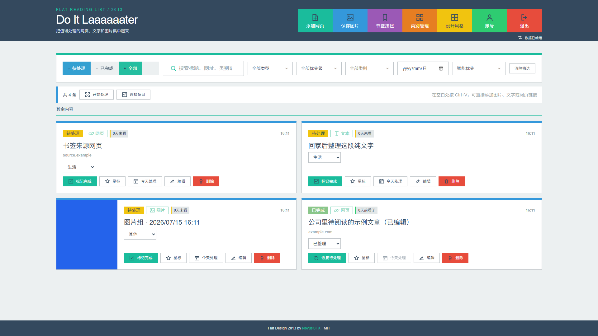
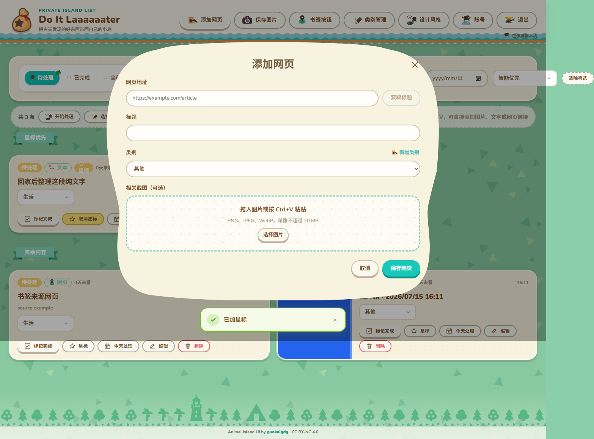

# Do It Laaaaaater

一个面向“白天发现、晚上处理”的个人稍后阅读系统。它可以保存网页、文字和截图，帮助你把临时收集变成一份真正可处理的清单。

项目既可以完全在 Windows 本机运行，也可以部署到 Vercel + Supabase，在公司、家里和手机之间同步。正式站点 [do-it-laaaaaater.vercel.app](https://do-it-laaaaaater.vercel.app) 是个人实例，不是公共演示站；每个部署只允许创建一个账号。

| Flat Design 2013（默认） | Animal Island UI |
| --- | --- |
|  |  |

## 当前版本（2026-07-24）

- 顶部新增统一“添加”入口，可分别添加网页、文本和图片；手机端也使用相同入口。
- “备忘录”升级为全账号唯一的无限画布，支持文字、图片、自由画笔、橡皮擦、选择、移动、缩放和旋转。
- 画布可切换纯色、网格、点阵和横线背景，并拥有不影响网站主题的独立昼夜模式。
- 资料库内容可以从侧栏筛选后拖入画布，形成与首页实时同步的卡片；卡片支持编辑、完成、星标、计划、回收站、恢复和图片预览。
- 画布及其原图会随版本 3 备份一起导出和恢复；本机与 Supabase 模式都使用独立的画布图片空间。
- 删除改为 7 天回收站，并提供约 10 秒撤销、批量恢复、彻底删除和自动到期清理。
- 手机可以一键识别剪贴板中的文字或网址；iPhone 还可按账号设置中的三步说明创建快捷指令。
- 原图和缩略图改为首页显示后在后台依次缓存，并提供进度、空间、暂停、继续和失败重试。
- 筛选无结果会明确显示当前条件，不再与真正的空资料库混淆。
- 计划处理支持今天、明天、一周后、清除和按具体日期排序；手机选择模式使用紧凑底部操作栏。
- 这次升级需要在已有 Supabase 项目中运行一次新的纯增量迁移，详见下方部署说明。

## 主要功能

### 快速收集

- 在首页直接粘贴网页地址、普通文字或多张图片，无需先点“添加”。
- 手机“添加”面板提供“识别剪贴板并保存”，会自动区分网址与文字并使用账号默认类别。
- iPhone 可创建“获取剪贴板 → 打开本站接收地址”的快捷指令，登录后自动保存并立即清除网址片段。
- 保存网页时自动读取标题和封面；读取失败仍可手动填写。
- 网址会经过规范化并检查重复，重复保存不会覆盖原条目或重置时间。
- 浏览器书签提供两种方式：
  - **快速保存**：用网页标题和账号默认类别自动保存。
  - **保存并分类**：在新标签页打开完整添加窗口。
- 两种书签都不会让正在阅读的原网页跳走；弹窗被阻止时会给出明确提示。

### 晚间处理

- 待处理、已完成和恢复状态。
- 星标、今天处理、未来计划、逾期提醒与智能优先排序。
- 计划日期提供今天、明天、一周后和清除快捷操作；未来计划显示具体日期。
- 最近保存、最久未看、最近完成、计划日期等排序方式，并记住当前浏览器的选择。
- 按内容类型、优先级、类别和保存日期组合筛选，搜索覆盖标题、网址、类别和图片文件名。
- 卡片上可直接修改类别、状态、星标和今日计划。
- 选择模式支持批量完成、恢复、改类别、星标、计划日期和移入回收站；手机使用紧凑底部栏展开完整操作。
- 真正空资料库、回收站为空和筛选无结果分别提供对应说明；当前筛选可以逐项移除或一次清空。
- 全屏晚间处理模式支持大按钮与桌面快捷键：方向键切换、`O` 打开、空格完成、`S` 星标、`T` 今日、`Esc` 退出。
- 待处理条目显示“X 天未看”，已完成条目显示“X 天前看了”，最多保留一位小数。

### 图片与截图

- 支持 PNG、JPEG、WebP。
- 单张不超过 20 MB，每组最多 30 张。
- 多图一次导入后组成一个可命名图片组。
- 网页条目也可以附带截图。
- 保存前和保存后都可以调整图片顺序。
- 网页截图选择区默认折叠为一行，避免遮住封面预览和主要表单。
- 图片查看器支持左右滑动、放大、缩小、拖动，以及打开或保存原图。
- 普通删除只会移入回收站并继续保留图片；彻底删除或 7 天到期后才清理相关图片。

### 单一备忘录画布

- 每个账号只有一张持续保存的无限画布，不会产生难以管理的多个画布。
- 支持文本、图片、画笔、橡皮擦和选框；卡片、图片与文字都可以移动、缩放和旋转。
- 画笔可调整颜色和粗细，撤销与重做沿用统一工具栏。
- 画布背景可在纯色、网格、点阵和横线之间切换，并可独立使用昼间或夜间模式。
- 侧栏沿用资料库的搜索、类别、状态和内容类型筛选。条目可拖入画布，手机也可点“放到画布”。
- 资料卡是实时引用，不是复制品。在画布中修改类别、标题、状态、星标或计划，首页会同步变化；从画布移除卡片不会删除资料库原条目。
- 画布自动保存到本机草稿并同步到当前数据源。断网时可以继续编辑，恢复网络后会再次同步。

### 数据可靠性

- 本机模式使用本地数据库和独立图片目录，重启后数据仍然保留。
- 云端模式使用 Supabase 登录、数据库与私人图片空间。
- 浏览器会按账号保存一份完整清单快照、文本、类别、偏好、缩略图和原图；首页资料先显示，图片在后台依次补齐，断网刷新后仍可查看已经同步的内容。
- 断网时可以继续新增、编辑、星标、安排日期、改类别、删除和处理图片。修改会进入持久队列，重新打开页面后仍然保留，并在联网后自动按顺序同步。
- 同一条目的连续快捷修改会合并；跨设备发生版本冲突时不会静默覆盖，可以选择保留云端内容或明确使用本机版本。
- “离线与缓存”面板会显示待同步数量、失败原因、图片缓存进度、浏览器空间、暂停/继续、手动重试和缓存清理入口。
- 添加、编辑和图片表单会把未完成草稿保存在当前浏览器，刷新后可恢复。
- 可导出版本化 ZIP 备份，选择是否包含全部原图。当前备份格式为版本 3，包含唯一画布、画布原图、背景和昼夜设置，并兼容导入版本 1、2。
- 恢复支持“安全合并”和“完整覆盖”；完整覆盖前会先自动生成当前数据的安全备份。
- 回收站保留 7 天；删除后可以立即撤销、在回收站恢复，或明确执行不可撤销的彻底删除。

离线阅读只覆盖本工具中已经同步的清单、文本和图片。保存的外部网页会保留标题与网址，但网页正文仍由原网站提供，断网时不能打开。

### 移动端

- 小屏幕使用固定底部导航：清单、筛选、添加、备忘录和更多；进入选择模式后会切换成紧凑批量操作栏。
- 添加入口集中提供网页、文本、图片与剪贴板快存；高级筛选和设置使用底部抽屉，不再占用首屏高度。
- 手机“更多”不显示桌面浏览器的书签安装入口，账号设置仍保留“添加到主屏幕”和 iPhone 快捷指令说明。
- Animal 风格使用组件库自带的 Bottom Drawer；Flat 风格使用对应的直角、纯色底部面板。
- 适配安全区、至少 44 像素的主要触控区域以及 390/430 像素宽度。

## 两套界面风格

- **Flat Design 2013**：默认风格。使用原设计库的纯色色板、磁贴布局、无阴影和直角组件规则。
- **Animal Island UI**：使用 `animal-island-ui@1.2.2` 的正式组件，以及项目内保存的原版背景、菜单、海面、树木和功能图标。

新增的默认类别、星标、批量操作、备份、进度提示和安装说明也分别适配了两套设计体系。Animal 风格优先使用组件库已有的 Card、Checkbox、Radio、Select、Progress、Notification 等组件；库中没有对应功能图标时，才按其圆润规则补充本地图标。Flat 风格则沿用其几何图标、原版色板和方形交互规则。

主题选择只保存在当前浏览器，并会同步到该浏览器已经打开的其他标签页。新浏览器默认使用 Flat Design 2013。

## 快速开始

需要 Node.js `22.13` 至 `24.x`。

```bash
git clone https://github.com/Andrei12138/do-it-laaaaaater.git
cd do-it-laaaaaater
npm install
npm run dev
```

开发模式启动后访问 <http://127.0.0.1:5173>。

Windows 用户也可以直接双击根目录的 `启动 Do It Laaaaaater.cmd`。脚本会准备依赖、启动应用并打开浏览器。

首次打开时创建唯一账号，密码至少 10 个字符。建号成功后注册会自动关闭。

## 本机数据位置

本机模式的数据位于项目根目录的 `data` 文件夹：

- `data/do-it-laaaaaater.sqlite`：账号、类别、条目、状态和偏好。
- `data/images/originals`：原图。
- `data/images/thumbs`：列表缩略图。
- `data/memo-canvas/images`：备忘录画布中独立放入的原图。

`data` 已被 Git 忽略。移动项目或更换电脑时，应先停止应用，再完整复制这个文件夹；也可以直接使用网页内的“数据备份与恢复”。

## 部署到 Vercel + Supabase

完整步骤见 [DEPLOYMENT.md](DEPLOYMENT.md)。云端模式需要两个公开连接变量：

```text
VITE_SUPABASE_URL=你的 Project URL
VITE_SUPABASE_ANON_KEY=你的 Publishable key
```

请勿把 Supabase 数据库密码或 `service_role` key 放进前端环境变量。

- 全新 Supabase 项目：运行 [`supabase/schema.sql`](supabase/schema.sql)。
- 从 2026-07-15 之前的版本升级：确认已经运行一次 [`supabase/migrations/20260715_workflow_ux_upgrade.sql`](supabase/migrations/20260715_workflow_ux_upgrade.sql)。这份增量升级只增加星标、今日计划和默认类别偏好，不会清空已有账号、条目、类别或图片。
- 已经完成上述升级：还需要运行一次 [`supabase/migrations/20260716_trash_ux_upgrade.sql`](supabase/migrations/20260716_trash_ux_upgrade.sql)。它只增加回收站时间字段和索引，不会清空或重建任何现有数据。
- 已经完成回收站升级：还需要运行一次 [`supabase/migrations/20260724_single_memo_canvas.sql`](supabase/migrations/20260724_single_memo_canvas.sql)。它只增加唯一画布、画布图片记录及其私有存储空间，不会清空现有账号、条目、类别或图片。
- 迁移成功并发布新版前，旧网站仍照常读取原有数据；请先在 Vercel Preview 验证，再合并到 `main`。

### 日常更新流程

本地修改完成后运行 `npm run check`，再提交并推送到 `main`。已连接本仓库的 Vercel 项目会自动构建并更新正式站点：

```bash
git add <本次修改的文件>
git commit -m "说明本次更新"
git push origin main
```

日常界面和前端逻辑更新不需要登录 Supabase 操作。只有 `supabase/schema.sql` 或 `supabase/migrations/` 出现新的数据库结构变更时，才需要执行对应 SQL；环境变量也只需在首次部署或密钥变更时更新。

## 安装到主屏幕

应用已经包含 PWA 清单、完整离线外壳、更新提示和 180/192/512 像素图标。

支持网页安装提示的浏览器会在“账号设置”中显示“安装应用”按钮。iPhone 与 iPad 受系统限制，需要在 Safari 中选择“分享 → 添加到主屏幕 → 添加”；界面会自动显示对应步骤。首次从主屏幕进入时可能需要重新登录一次。

同一位置还提供 iPhone 剪贴板快捷指令说明。快捷指令把编码后的文字或网址放在 `#quick-clipboard=` 后面，片段不会进入 Vercel 的访问地址记录；网站在登录后读取并立即清除，再按默认类别保存。

## 项目结构

```text
src/                    网页界面、主题、离线队列、备份和交互
server/                 本机账号、数据库、图片与网页信息读取
api/                    Vercel 网页信息读取入口
supabase/               全新建库脚本与增量升级脚本
public/                 PWA 清单、离线外壳和应用图标
tests/                  接口、数据库升级、时间与浏览器流程检查
licenses/               第三方许可文本
```

## 开发与验证

```bash
npm run typecheck       # 检查前后端类型
npm test                # 运行 27 项自动检查
npm run build           # 生成正式版本
npm run test:e2e        # 在 Edge 中操作完整正式版本
npm run check           # 类型检查 + 自动检查 + 正式构建
```

浏览器测试使用已经生成的 `dist` 和 `dist-server`，因此修改后应先执行 `npm run build`，再执行 `npm run test:e2e`。

当前完整浏览器流程覆盖建号、登录、直接粘贴、剪贴板一键保存、iPhone 接收入口、图片保存前排序、缩放与原图操作、重复网址、快速书签、默认类别、星标、未来计划、智能排序、晚间模式、手机批量栏、回收站撤销/恢复/彻底删除、草稿恢复、两种主题、移动端导航、唯一备忘录画布、四种画布背景、画布昼夜模式、资料卡同步、画布图片和版本 3 备份恢复，以及断网读取、断网写入、后台图片缓存和恢复联网后的自动同步。

## 安全边界

- 网页信息读取设置了超时、响应大小限制和危险地址拦截。
- Supabase 图片空间为私人空间，访问由当前账号控制。
- PWA 的 Cache Storage 只保存网页外壳和版本化静态资源。清单与私人图片保存在按账号隔离的 IndexedDB 中，退出账号时会清除；登录凭据和 ZIP 备份不会进入离线队列或图片缓存。
- ZIP 恢复会检查版本、文件类型、图片大小、组内数量、危险路径和清单一致性。
- 云端通常无法读取公司内网页；书签仍可带回浏览器看到的网址和标题，但不保证取得封面。

## 素材与许可

Animal Island UI 的正式包和源仓库使用 **CC BY-NC 4.0**，因此本项目当前的 Animal 素材仅适合个人、非商业用途。若要商用，需要替换这些素材或另行取得授权。

Flat Design 2013 来源于 NovusGFX Retro Design System，按 MIT 许可使用。详细作者、固定版本、来源提交和许可文本见 [THIRD_PARTY_NOTICES.md](THIRD_PARTY_NOTICES.md)。

本仓库目前没有为项目自身代码声明通用开源许可证。仓库公开可见不等于自动授予复制、修改或商业使用权；计划接受外部使用或贡献时，应先补充明确的项目许可证与贡献说明。
